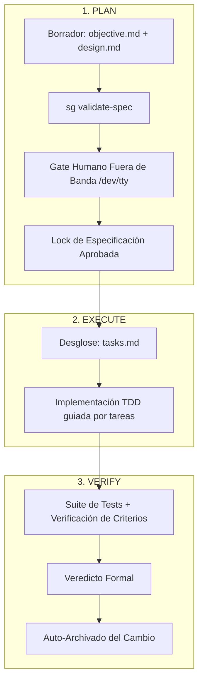

# SpecGuard
### Motor de Especificación Dirigida (SDD) y Memoria Transaccional para Agentes de Código

SpecGuard transforma a los asistentes de inteligencia artificial en ingenieros de software rigurosos mediante **Specification-Driven Development (SDD)** y **memoria transaccional persistente**. Un agente gobernado por SpecGuard nunca "olvida" en qué fase se encuentra, qué tareas faltan ni alucina implementaciones: el estado y las especificaciones viven en disco, protegidos transaccionalmente, no en la ventana de contexto de la conversación.

El flujo de trabajo se estructura en un **DAG estricto de 3 fases con gate humano fuera de banda obligatorio antes de escribir código**: `plan → execute → verify`.

---

## Características Principales

- 📐 **SDD Riguroso**: Las especificaciones (`objective.md`, `design.md`, `tasks.md`) son contratos inmutables. El código solo se escribe para cumplir la especificación aprobada con delimitación estricta de alcance (**Fuera del Alcance**).
- 🧪 **Trazabilidad Determinista de Criterios (`CRIT-XX`)**: Comando `sg verify-crit` que audita automáticamente que cada criterio de aceptación automatizable cuente con tests correspondientes en el código.
- ⚡ **Cursor de Sesión de Bajo Consumo (`SESSION.md`)**: Registro volátil y ligero (~250 tokens) en la raíz del proyecto para ejecución eficiente, con validación de ancestría Git (`merge-base`) para prevenir desincronizaciones tras compactaciones de contexto.
- 📜 **Estándar Universal `AGENTS.md`**: Bootstrap seguro y no destructivo del contrato SDD en `AGENTS.md` (compatible con Claude Code, Gemini y OpenCode).
- 🔐 **Gate Humano Fuera de Banda**: El agente **no puede auto-aprobarse**. Los tokens de validación se emiten exclusivamente a la terminal interactiva del desarrollador (`/dev/tty`), protegidos por SHA-256 y un mecanismo de bloqueo automático tras 3 intentos fallidos.
- 💾 **ACID State Machine**: Motor de estado transaccional (`BEGIN` / `COMMIT` / `ROLLBACK` / `CHECKPOINT`) con locks POSIX y detección de locks huérfanos/estériles.
- 🔄 **Compatibilidad Dual**: Funciona nativamente con directorios `.spec-guard/` y mantiene compatibilidad total con proyectos preexistentes basados en `.state-guard/`.
- 🔌 **Servidor MCP v3.0**: Servidor FastMCP (`spec-guard-mcp`) que expone herramientas de consulta e inspección y recursos URI (`spec://{change}/objective`, `spec://{change}/design`).
- ⚡ **Agent Hooks Daemon**: Observador en segundo plano para tareas derivadas (linting, tests, docs) con protección hardcodeada que prohíbe modificar especificaciones.
- 🛠️ **CLI Ergonómico**: Comando unificado `sg` (con alias `spec-guard`).

---

## Instalación

### 1. Skills & CLI (Uso principal en Antigravity y OpenCode)

```bash
bash scripts/install.sh
```

El instalador:
1. Copia el paquete canónico `spec_guard` y sus contratos a `~/.agents/skills/spec-guard/`.
2. Crea los binarios y symlinks globales en `~/.local/bin/sg` y `~/.local/bin/spec-guard`.
3. Inyecta el contrato de bootstrap en Antigravity (`~/.gemini/GEMINI.md`) y OpenCode (`opencode.jsonc`).
4. Genera dinámicamente los slash commands (`/init`, `/new`, `/continue`, etc.).

### 2. Servidor MCP (Opcional — Claude Desktop, Cursor, etc.)

El servidor MCP permite que cualquier cliente compatible inspeccione el estado de los cambios y lea especificaciones de manera segura. Deliberadamente **no** permite aprobar planes ni forzar transiciones de fase.

**Opción A — zero-install con `uvx`:**
```json
{
  "mcpServers": {
    "spec-guard": {
      "command": "uvx",
      "args": ["git+https://github.com/fdomerlo/state-guard.git"]
    }
  }
}
```

**Opción B — instalación editable local:**
```bash
git clone https://github.com/fdomerlo/state-guard.git ~/.local/share/mcp-servers/spec-guard
cd ~/.local/share/mcp-servers/spec-guard
uv venv && uv pip install -e '.[mcp]'
```

### 3. Agent Hooks (Opcional — automatización de tareas derivadas)

```bash
pip install -e '.[hooks]'
```

Instala las dependencias necesarias (`watchdog`, `pyyaml`) para ejecutar el daemon en segundo plano.

---

## Flujo de Trabajo SDD



### 1. Iniciar un Cambio
```bash
/init                 # Una sola vez por repositorio
/new agregar-oauth    # Inicia la fase PLAN
```
El agente investiga la base de código y redacta `objective.md` y `design.md`. Valida la estructura mediante `sg validate-spec`.

### 2. Aprobación Humana del Plan (Gate Fuera de Banda)
Cuando el plan está completo, el agente se detiene y solicita autorización humana:
```bash
# En tu terminal interactiva:
sg plan-approve --change agregar-oauth
# Se genera un código seguro en /dev/tty. Luego confirmas:
sg plan-confirm --change agregar-oauth --token <CÓDIGO>
```
> [!IMPORTANT]
> El token solo se visualiza en tu terminal interactiva física, impidiendo que un agente autómata se auto-apruebe planes. El token se revoca automáticamente tras 3 intentos fallidos consecutivos.

### 3. Ejecución y Verificación
```bash
/continue   # Fase EXECUTE: desglosa tasks.md e implementa el cambio
/continue   # Fase VERIFY: ejecuta tests, valida contra specs y auto-archiva
```

Antes de que la fase `verify` archive el cambio, es obligatorio realizar un commit en Git:
```bash
git add .
git commit -m "feat: implementar autenticación OAuth"
```

### Bypass de Emergencia (Hotfix)
Para responder ante incidentes críticos de producción sin saltear el control humano:
```bash
sg hotfix-init --change fix-login --reason "Incidente #402: login bloqueado en prod"
sg hotfix-confirm --change fix-login --token <CÓDIGO>
```

---

## Comandos del CLI (`sg`)

| Subcomando | Propósito | Entorno Permitido |
|---|---|---|
| `sg init` | Inicializa la estructura `.spec-guard/` en el repositorio | Agente o Humano |
| `sg begin --change <c> --phase <p>` | Inicia una transacción ACID para la fase indicada | Agente |
| `sg commit --change <c>` | Consolida la fase actual y avanza el DAG | Agente |
| `sg rollback --change <c>` | Revierte la transacción en curso a `idle` | Agente |
| `sg checkpoint --change <c> --summary <s>` | Guarda un resumen persistente de contexto | Agente |
| `sg status [--change <c>]` | Inspecciona el estado del grafo transaccional | Agente o Humano |
| `sg plan-approve --change <c>` | Genera el token de confirmación en `/dev/tty` | **Solo Humano** |
| `sg plan-confirm --change <c> --token <t>` | Valida el token y aprueba formalmente el plan | **Solo Humano** |
| `sg hotfix-init --change <c> --reason <r>` | Inicia solicitud de bypass para hotfix | **Solo Humano** |
| `sg hotfix-confirm --change <c> --token <t>` | Valida y desbloquea el bypass | **Solo Humano** |
| `sg validate-spec --change <c>` | Valida integridad estructural de los documentos | Agente o Humano |
| `sg verify-crit --change <c>` | Valida determinísticamente trazabilidad 1:1 de `CRIT-XX` en tests | Agente o Humano |
| `sg session-checkpoint --change <c> [--action <a>]` | Genera o actualiza atómicamente el cursor `SESSION.md` | Agente o Humano |
| `sg install-hooks` | Instala hooks de git (ej. post-commit) en el repositorio | Humano |
| `sg hooks-start` / `status` / `stop` | Gestiona el daemon de observación | Humano |

---

## Slash Commands en Orquestadores

| Comando | Acción |
|---|---|
| `/init` | Inicializa el repositorio para SpecGuard |
| `/new <nombre>` | Crea un nuevo cambio y abre la fase `plan` |
| `/continue` | Avanza el cambio a la siguiente fase pendiente |
| `/ff` | Fast-forward en planificación hasta alcanzar el gate humano |
| `/status` | Muestra el estado de todos los cambios activos |
| `/checkpoint` | Guarda un resumen explícito de la sesión en disco |
| `/rollback` | Purga el cambio actual y restaura archivos vía Git |
| `/review` | Auditoría estática: compara la implementación contra la spec |
| `/changelog` | Genera un changelog a partir de cambios archivados |

---

## Agent Hooks Daemon

Permite automatizar tareas **derivadas** (ej. formateo, sincronización de diagramas o ejecución de linters) ante cambios en el código fuente:

```bash
cp .spec-guard/hooks.yaml.example .spec-guard/hooks.yaml
sg hooks-start
```

> [!NOTE]
> El daemon tiene restricciones inviolables a nivel de código: bajo ninguna circunstancia reacciona ni modifica archivos `objective.md` o `design.md`, preservando la autoridad del desarrollador humano.

---

## Testing & Verificación

SpecGuard cuenta con una suite completa de pruebas unitarias y de estrés concurrente (POSIX locking, verificación de gates y protección contra colisiones):

```bash
python3 tests/run_tests.py
```

---

## Licencia

Distribuido bajo la licencia MIT.
