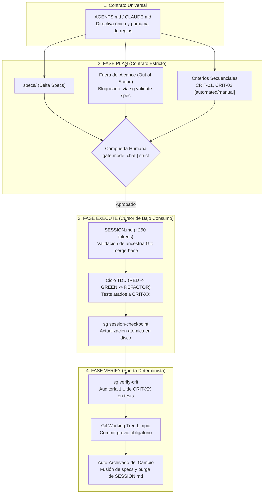

# SpecGuard

> **Motor de Desarrollo Dirigido por Especificaciones (SDD) y Gobernador Transaccional para Agentes de Código.**

SpecGuard no es una simple *skill* o extensión pasiva: es un **entorno de gobierno y persistencia transaccional** que transforma a los asistentes de inteligencia artificial (Antigravity, Claude Code, OpenCode, Gemini, Cursor) en ingenieros de software rigurosos y predecibles.

El principal problema de los agentes autónomos de código es la amnesia y la deriva: pierden el contexto tras compactaciones de ventana, olvidan el alcance original, omiten pruebas y auto-aprueban planes incompletos. SpecGuard traslada la verdad del proyecto **de la ventana de contexto al disco**, administrando el ciclo de vida de desarrollo mediante una máquina de estados ACID protegida por locks POSIX y un grafo acíclico dirigido (DAG) de tres fases.

---

## 🏗️ Los Pilares de SpecGuard



### 1. Contrato Universal de Agentes (`AGENTS.md`)
Inyección no destructiva de bootstrap estandarizada en la raíz del proyecto. Cualquier agente (Claude Code vía `@AGENTS.md` en `CLAUDE.md`, Antigravity vía `GEMINI.md`, OpenCode vía `opencode.jsonc`) asimila de inmediato el estado del DAG antes de interactuar.

### 2. Trazabilidad Determinista de Criterios (`CRIT-XX`)
Los requerimientos no se redactan en prosa ambigua. Todo cambio define criterios unívocos `CRIT-01`, `CRIT-02` marcados como `[automated]` o `[manual]`. El comando `sg verify-crit` audita el repositorio antes del cierre: **si un criterio automatizable no cuenta con tests en el código, el pase a producción queda bloqueado**.

### 3. Cursor de Sesión de Bajo Consumo (`SESSION.md`)
Para evitar consumir miles de tokens releyendo planes gigantescos en cada prompt durante la implementación, SpecGuard mantiene un archivo volátil `SESSION.md` (~250 tokens) en la raíz. Incluye validación de ancestría Git (`git merge-base --is-ancestor`) para alertar al instante si el repositorio sufrió rebases o desincronizaciones tras una compactación de contexto.

### 4. Modos de Compuerta Humana Configurables (`chat` vs `strict`)
El agente **nunca puede auto-aprobarse** para comenzar a modificar código fuente:
- **Modo `chat` (Predeterminado — Cero Fricción)**:
  Diseñado para pair-programming interactivo. El agente está obligado a hacer un **STOP** explícito en la conversación, presentar el plan y solicitar tu autorización. Al responder afirmativamente en el chat, el agente ejecuta `sg commit` registrando la aprobación (`plan_approved_by = chat`) sin salir de la conversación.
- **Modo `strict` (Máxima Seguridad Adversarial)**:
  Diseñado para agentes autónomos con ejecución de consola desatendida. `sg commit` rechaza la fase con código `EXIT_GATE_REQUIRED (5)` y exige un token criptográfico generado fuera de banda en la terminal física interactiva del humano (`/dev/tty`) mediante `sg plan-approve` y `sg plan-confirm`.

### 5. Motor Transaccional ACID
Garantiza aislamiento estricto entre fases mediante `BEGIN`, `COMMIT`, `ROLLBACK` y `CHECKPOINT`. Utiliza bloqueos de archivo POSIX (`fcntl`), con caducidad TTL automática y detección de locks estériles (*stale lock recovery*).

---

## 📦 Interfaces del Sistema

SpecGuard se manifiesta según la necesidad de tu entorno:

1. **CLI Unificado (`sg` / `spec-guard`)**: Herramienta de línea de comandos en `$PATH` para humanos y agentes.
2. **Skill Nativa para Antigravity**: Registrada en `~/.gemini/config/skills/spec-guard/SKILL.md`.
3. **Sub-Agente y Slash Commands para OpenCode**: Registrado en `opencode.jsonc` con comandos dinámicos (`/init`, `/new`, `/continue`, `/status`, `/checkpoint`, etc.).
4. **Servidor MCP (`spec-guard-mcp`)**: Herramientas y recursos URI (`spec://{change}/objective`, `spec://{change}/design`) sobre standard I/O para clientes MCP (Claude Desktop, Cursor).
5. **Daemon de Hooks en Background (`sg hooks-start`)**: Automatización de tareas derivadas (linting, sync de tests) con prohibición hardcodeada de tocar especificaciones.

---

## 🚀 Instalación y Puesta en Marcha

### 1. Instalación Universal en el Sistema

Ejecuta el script de instalación desde la raíz del repositorio:

```bash
bash scripts/install.sh
```

El instalador:
- Compila e instala el paquete `spec_guard` en `~/.agents/skills/spec-guard/`.
- Crea los enlaces simbólicos ejecutables en `~/.local/bin/` (`sg`, `spec-guard`, `sg-verify-crit`, `sg-init`).
- Registra la skill nativa en Antigravity (`~/.gemini/config/skills/spec-guard/SKILL.md`).
- Configura el agente en OpenCode (`~/.config/opencode/opencode.jsonc`) y genera los slash commands.
- Inyecta el contrato de arranque en `~/.gemini/GEMINI.md`.

### 2. Inicializar SpecGuard en un Nuevo Repositorio

En cualquier repositorio que quieras gobernar con SpecGuard:

```bash
sg init
# o dentro de una sesión de chat con un agente:
/init
```

Esto detectará el stack de tu proyecto y creará:
- `AGENTS.md` (con enlace en `CLAUDE.md`).
- `.spec-guard/config.yaml` (configurado por defecto con `gate.mode: chat`).
- Directorios `.spec-guard/specs/` y `.spec-guard/changes/`.

---

## 🔄 Flujo de Trabajo Cotidiano

### Paso 1: Crear un Nuevo Cambio (Fase PLAN)
En la terminal o en el chat:
```bash
sg begin --change agregar-autenticacion --phase plan
# o en chat:
/new agregar-autenticacion
```
El agente investiga la arquitectura del repositorio y redacta en `.spec-guard/changes/agregar-autenticacion/`:
- `objective.md`: Contexto, requerimientos y la sección obligatoria **Fuera del Alcance** (*Out of Scope*).
- `design.md`: Decisiones arquitectónicas y diagrama de componentes.
- `tasks.md`: Desglose jerárquico de tareas con criterios `CRIT-01`, `CRIT-02` asociados.

### Paso 2: Validación y Compuerta Humana
El agente valida la especificación:
```bash
sg validate-spec --change agregar-autenticacion
```

- **En Modo `chat` (Default)**: El agente hace una pausa obligatoria (**STOP**), resume el plan en el chat y solicita confirmación. Tras tu visto bueno, ejecuta el commit a `execute`:
  ```bash
  sg commit --change agregar-autenticacion --next-phase execute
  ```

- **En Modo `strict`**: Si configuraste `gate.mode: strict`, `sg commit` requerirá token interactivo:
  ```bash
  # En tu terminal física:
  sg plan-approve --change agregar-autenticacion
  sg plan-confirm --change agregar-autenticacion --token <TOKEN>
  ```

### Paso 3: Implementación con Cursor Ligero (Fase EXECUTE)
El agente inicia la transacción de ejecución:
```bash
sg begin --change agregar-autenticacion --phase execute
# o en chat:
/continue
```
- Se genera en la raíz `SESSION.md` (~250 tokens), registrando el `base_commit` de Git y el cursor de tareas.
- El agente aplica el ciclo **TDD**: escribe las pruebas nombradas según el criterio (`test_crit_01_login_exitoso`) antes de escribir la implementación.
- Cada tarea completada actualiza el checkpoint atómicamente:
  ```bash
  sg session-checkpoint --change agregar-autenticacion --action "Completada tarea 1.2"
  ```
- Al terminar todas las tareas, avanza a verificación:
  ```bash
  sg commit --change agregar-autenticacion --next-phase verify
  ```

### Paso 4: Verificación Determinista y Archivado (Fase VERIFY)
```bash
sg begin --change agregar-autenticacion --phase verify
# o en chat:
/continue
```
1. **Auditoría de Criterios**: Se corre `sg verify-crit --change agregar-autenticacion`. Si algún `CRIT-XX [automated]` no tiene tests en el código fuente, la fase se interrumpe con error.
2. **Suite de Pruebas y Build**: Se ejecutan los comandos de test y build del proyecto.
3. **Commit de Git**: El árbol de trabajo debe confirmarse limpiamente en Git (`git commit`).
4. **Archivado Automático**: Se consolida el cambio en `.spec-guard/changes/archive/`, se fusionan las especificaciones delta en `.spec-guard/specs/` y se elimina `SESSION.md`.

---

## 🛠️ Referencia de Comandos CLI (`sg`)

| Subcomando | Descripción | Ámbito |
|---|---|---|
| `sg init` | Inicializa `.spec-guard/` y `AGENTS.md` en el proyecto actual | Humano / Agente |
| `sg begin --change <c> --phase <p>` | Inicia una transacción ACID para la fase (`plan`, `execute`, `verify`) | Agente |
| `sg commit --change <c> --next-phase <p>` | Confirma la fase actual y avanza el DAG | Agente |
| `sg rollback --change <c>` | Revierte la transacción activa a estado `idle` | Agente / Humano |
| `sg checkpoint --change <c> --summary <s>` | Guarda un resumen en `state.ini[Session]` (límite 2000 caracteres) | Agente |
| `sg status [--change <c>]` | Muestra el estado del grafo transaccional y el cambio activo | Humano / Agente |
| `sg session-checkpoint --change <c>` | Genera o actualiza el cursor volátil `SESSION.md` validando ancestría Git | Agente |
| `sg verify-crit --change <c>` | Audita trazabilidad 1:1 de criterios `CRIT-XX` contra suites de test | Agente / Humano |
| `sg validate-spec --change <c>` | Verifica integridad estructural y presencia obligatoria de *Out of Scope* | Agente / Humano |
| `sg plan-approve --change <c>` | Emite token de aprobación fuera de banda en `/dev/tty` (modo `strict`) | **Solo Humano** |
| `sg plan-confirm --change <c> --token <t>` | Valida el token y aprueba el plan (modo `strict`) | **Solo Humano** |
| `sg hotfix-init --change <c> --reason <r>` | Solicita bypass auditado de hotfix fuera de banda | **Solo Humano** |
| `sg hotfix-confirm --change <c> --token <t>` | Consume token y desbloquea inicio directo en `execute` | **Solo Humano** |
| `sg install-hooks` | Instala hooks de Git en el repositorio | Humano |
| `sg hooks-start` / `status` / `stop` | Administra el observador en background de reglas derivadas | Humano |

---

## ⚙️ Configuración (`.spec-guard/config.yaml`)

```yaml
schema: spec-driven

gate:
  mode: chat  # 'chat' (default, cero fricción) | 'strict' (fuera de banda /dev/tty)

rules:
  change_naming: kebab-case
  execute:
    - Seguir patrones y convenciones existentes del proyecto
    - Aplicar TDD asociando cada test a un criterio CRIT-XX
  verify:
    - build_command: npm test  # o pytest / make test
    - Criterios CRIT-XX automatizables deben contar con tests
```

---

## 🧪 Pruebas Automatizadas

SpecGuard cuenta con una exhaustiva suite de pruebas unitarias y de estrés concurrente (POSIX locking, mitigación de condiciones de carrera, verificación criptográfica de tokens y validación de modos de compuerta):

```bash
python3 tests/run_tests.py
```

```text
Resultados: 50 PASSED, 0 FAILED
✓ Todas las suites de pruebas completadas con éxito.
```

---

## 📄 Licencia

Distribuido bajo la licencia [MIT](LICENSE).
